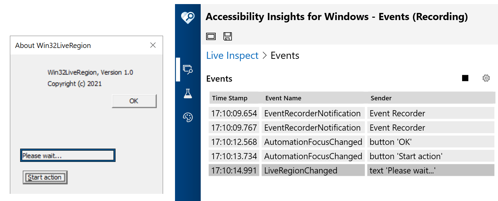

# Win32LiveRegion

This Win32 app was created from the Win32 app template in VS 2019, and then modified by me.

Do the following:

1. Run Narrator before running this demo app.
2. Do Help->About.
3. Using the keyboard, click the "Start action" button. 

Narrator will then announce the "Please wait..." text that appears.

The image below shows the Accessibility Insights for Windows tool reporting that a LiveRegionChanged event is being raised by the app.

